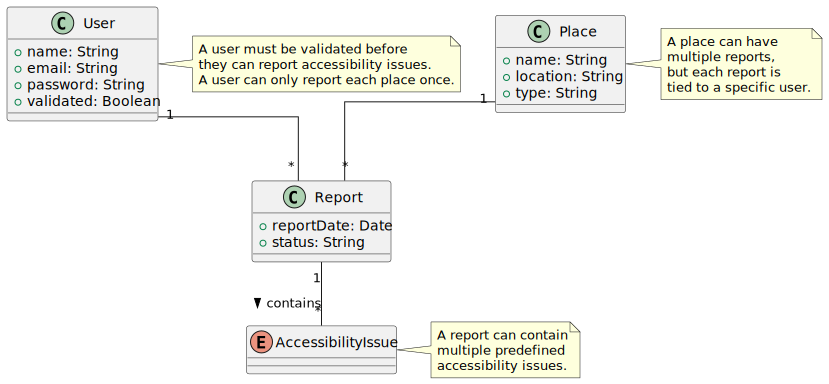
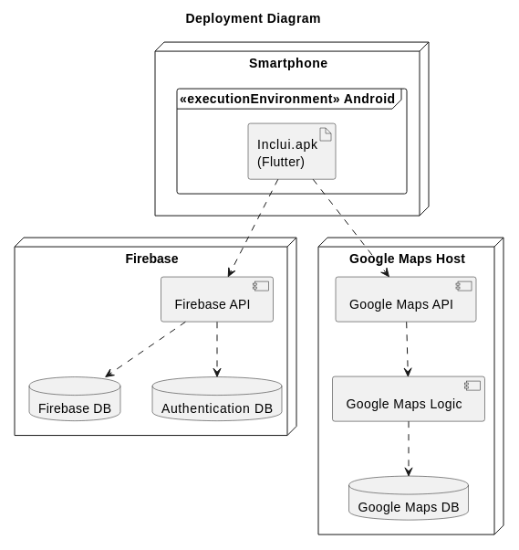

# Inclui Development Report

 

  

 

Welcome to the documentation pages of **Inclui**!

This Software Development Report, tailored for LEIC-ES-2024-25, provides comprehensive details about **Inclui**, from high-level vision to low-level implementation decisions. It’s organised by the following activities.

- [Business modeling](#Business-Modelling)
  - [Product Vision](#Product-Vision)
  - [Features and Assumptions](#Features-and-Assumptions)
  - [Elevator Pitch](#Elevator-pitch)
- [Requirements](#Requirements)
  - [User stories](#User-stories)
  - [Domain model](#Domain-model)
- [Architecture and Design](#Architecture-And-Design)
  - [Logical architecture](#Logical-Architecture)
  - [Physical architecture](#Physical-Architecture)
  - [Vertical prototype](#Vertical-Prototype)
- [Project management](#Project-Management)
  - [Sprint 0](#Sprint-0)
  - [Sprint 1](#Sprint-1)
  - [Sprint 2](#Sprint-2)
  - [Sprint 3](#Sprint-3)
  - [Sprint 4](#Sprint-4)
  - [Final Release](#Final-Release)

Contributions are expected to be made exclusively by the initial team, but we may open them to the community, after the course, in all areas and topics: requirements, technologies, development, experimentation, testing, etc.

Please contact us!

Thank you!

- Diana Magro (up202305465@up.pt),
- Joana Carvalhal (up202306568@up.pt),
- Martim Cadilhe (up202307833@up.pt),
- Pedro Araújo (up202306606@up.pt),
- Simão Barbosa (up202306609@up.pt)

---

## Business Modelling

Business modeling in software development involves defining the product's vision, understanding market needs, aligning features with user expectations, and setting the groundwork for strategic planning and execution.

### Product Vision

For individuals seeking inclusive and accessible places, who need to find establishments that embrace diversity, **Inclui** is a mobile application that allows users to rate establishments based on accessibility features, such as wheelchair ramps, Braille menus, and other inclusivity aspects, helping people find places that meet their needs. Unlike general review apps that allow you to rate places based on your personal preferences, our product focuses specifically on accessibility, ensuring users can easily identify welcoming and accommodating establishments.

<!--
Start by defining a clear and concise vision for your app, to help members of the team, contributors, and users into focusing their often disparate views into a concise, visual, and short textual form.

The vision should provide a "high concept" of the product for marketers, developers, and managers.

A product vision describes the essential of the product and sets the direction to where a product is headed, and what the product will deliver in the future.

**We favor a catchy and concise statement, ideally one sentence.**

We suggest you use the product vision template described in the following link:
* [How To Create A Convincing Product Vision To Guide Your Team, by uxstudioteam.com](https://uxstudioteam.com/ux-blog/product-vision/)

To learn more about how to write a good product vision, please see:
* [Vision, by scrumbook.org](http://scrumbook.org/value-stream/vision.html)
* [Product Management: Product Vision, by ProductPlan](https://www.productplan.com/glossary/product-vision/)
* [How to write a vision, by dummies.com](https://www.dummies.com/business/marketing/branding/how-to-write-vision-and-mission-statements-for-your-brand/)
* [20 Inspiring Vision Statement Examples (2019 Updated), by lifehack.org](https://www.lifehack.org/articles/work/20-sample-vision-statement-for-the-new-startup.html)
-->

### Features and Assumptions

<!--
Indicate an  initial/tentative list of high-level features - high-level capabilities or desired services of the system that are necessary to deliver benefits to the users.
 - Feature XPTO - a few words to briefly describe the feature
 - Feature ABCD - ...
...

Optionally, indicate an initial/tentative list of assumptions that you are doing about the app and dependencies of the app to other systems.
-->

### Elevator Pitch

<!--
Draft a small text to help you quickly introduce and describe your product in a short time (lift travel time ~90 seconds) and a few words (~800 characters), a technique usually known as elevator pitch.

Take a look at the following links to learn some techniques:
* [Crafting an Elevator Pitch](https://www.mindtools.com/pages/article/elevator-pitch.htm)
* [The Best Elevator Pitch Examples, Templates, and Tactics - A Guide to Writing an Unforgettable Elevator Speech, by strategypeak.com](https://strategypeak.com/elevator-pitch-examples/)
* [Top 7 Killer Elevator Pitch Examples, by toggl.com](https://blog.toggl.com/elevator-pitch-examples/)
-->

## Requirements

### User Stories

- As a user, I want to search for places that accommodate specific accessibility requirements, so that I can get a list view of suitable locations.
- As a validated user, I want to report an accessibility issue at a location, so that others are informed.
- As a user, I want to search for a specific place, so that I can view it's accessibility issues.
- As a registered user, I want to access my profile page, so that I can view and update my preferences.
- As an unregistered user, I want to create an account and log in, so that I can filter results based on my accessibility needs.
- As a user, I want to view accessibility issues in nearby places in a map view, so that I can identify unsuitable locations.
- As an unvalidated user, I want to verify my profile, so that I can report accessibility issues.
- As a verified user, I want to access my review history so that I can view past reviews and delete outdated ones.

<!--
In this section, you should describe all kinds of requirements for your module: functional and non-functional requirements.

For LEIC-ES-2024-25, the requirements will be gathered and documented as user stories.

Please add in this section a concise summary of all the user stories.

**User stories as GitHub Project Items**
The user stories themselves should be created and described as items in your GitHub Project with the label "user story".

A user story is a description of a desired functionality told from the perspective of the user or customer. A starting template for the description of a user story is *As a < user role >, I want < goal > so that < reason >.*

Name the item with either the full user story or a shorter name. In the “comments” field, add relevant notes, mockup images, and acceptance test scenarios, linking to the acceptance test in Gherkin when available, and finally estimate value and effort.

**INVEST in good user stories**.
You may add more details after, but the shorter and complete, the better. In order to decide if the user story is good, please follow the [INVEST guidelines](https://xp123.com/articles/invest-in-good-stories-and-smart-tasks/).

**User interface mockups**.
After the user story text, you should add a draft of the corresponding user interfaces, a simple mockup or draft, if applicable.

**Acceptance tests**.
For each user story you should write also the acceptance tests (textually in [Gherkin](https://cucumber.io/docs/gherkin/reference/)), i.e., a description of scenarios (situations) that will help to confirm that the system satisfies the requirements addressed by the user story.

**Value and effort**.
At the end, it is good to add a rough indication of the value of the user story to the customers (e.g. [MoSCoW](https://en.wikipedia.org/wiki/MoSCoW_method) method) and the team should add an estimation of the effort to implement it, for example, using points in a kind-of-a Fibonnacci scale (1,2,3,5,8,13,20,40, no idea).

-->

### Domain model

  

- **User**: Represents an individual who can report accessibility issues for various places. A user can only report each place once, and they must be validated before submitting any reports.
- **Place**: A physical location (e.g., restaurant, store) that can have multiple reports associated with it. Each place can have various accessibility issues reported by different users.
- **AccessibilityIssue**: A predefined category of accessibility problem, such as missing wheelchair ramps or lack of Braille menus. Multiple places can share the same accessibility issue type, but each report can contain multiple instances of these issues.
- **Report**: A user-submitted record documenting the accessibility issues found at a particular place. A report can include multiple accessibility issues and is tied to both a specific user and a specific place.

## Architecture and Design

<!--
The architecture of a software system encompasses the set of key decisions about its organization.

A well written architecture document is brief and reduces the amount of time it takes new programmers to a project to understand the code to feel able to make modifications and enhancements.

To document the architecture requires describing the decomposition of the system in their parts (high-level components) and the key behaviors and collaborations between them.

In this section you should start by briefly describing the components of the project and their interrelations. You should describe how you solved typical problems you may have encountered, pointing to well-known architectural and design patterns, if applicable.
-->

### Logical architecture

The Package Model below provides a high-level overview of the system's logical structure, illustrating the key packages and their interactions.

  

- **Application**: The core of the system, containing three main packages: User Interface, Business Logic, and Data Management.
  - **User Interface**: Contains the application's primary screens, such as the HomePage, SearchPage, ReportPage, and LoginPage. It also includes MapView, which is part of the HomePage and is used to visually display places and accessibility issues. The User Interface interacts with Business Logic to process user actions and with Authentication & Authorization to manage authentication.
  - **Business Logic**: Handles the core functionalities of the system, such as Search, Report, AccessibilityIssue, and Place management. It processes user inputs, retrieves relevant data, ensures the correct execution of business rules, and communicates with external services such as Google Maps when additional data is required.
  - **Data Management**: Responsible for data storage and retrieval. It contains DatabaseHandler, which manages database operations. The Business Logic layer depends on this package for data persistence and retrieval.
- **External Programs**: A collection of external services that the application relies on. It contains two sub-packages: Google Maps e Firebase.
  - **Firebase**: Provides authentication, authorization, and database management functionalities. It contains Authentication & Authorization, which manages user authentication, profile validation, and interaction with Data Management to validate user credentials. It also includes Database, responsible for storing application data.
  - **Google Maps**: Provides mapping and location-based services. It contains GoogleMapsAPI, which allows the application to fetch location-based information and display places on the MapView. The Business Logic layer communicates with this API when necessary.

<!--
The purpose of this subsection is to document the high-level logical structure of the code (Logical View), using a UML diagram with logical packages, without the worry of allocating to components, processes or machines.

It can be beneficial to present the system in a horizontal decomposition, defining layers and implementation concepts, such as the user interface, business logic and concepts.

Example of _UML package diagram_ showing a _logical view_ of the Eletronic Ticketing System (to be accompanied by a short description of each package):

-->

### Physical architecture

  

This deployment diagram illustrates the architecture of a Flutter and Dart based mobile application, distributed as the Inclui.apk file, deployed on an Android smartphone. It communicates with an authentication service to validate user credentials to ensure secure access to the application's features. Additionally, it features the Google Maps Host to provide real-time location data features, enhancing navigation and accessibility. The architecture is designed to be robust, scalable, and user-friendly.

<!--
The goal of this subsection is to document the high-level physical structure of the software system (machines, connections, software components installed, and their dependencies) using UML deployment diagrams (Deployment View) or component diagrams (Implementation View), separate or integrated, showing the physical structure of the system.

It should describe also the technologies considered and justify the selections made. Examples of technologies relevant for ESOF are, for example, frameworks for mobile applications (such as Flutter).

Example of _UML deployment diagram_ showing a _deployment view_ of the Eletronic Ticketing System (please notice that, instead of software components, one should represent their physical/executable manifestations for deployment, called artifacts in UML; the diagram should be accompanied by a short description of each node and artifact):

-->

### Vertical prototype

To validate our technological choices, we developed a vertical prototype integrating Firebase and location services.  

For data management, we set up a [Firebase Realtime Database](https://firebase.google.com/docs/database), allowing the app to store, display, and clear entries dynamically. Authentication was implemented using [Firebase Auth](https://firebase.google.com/docs/auth), enabling user sign-in, account creation, and session management with error handling. Additionally, location services were integrated using the [Geolocator](https://pub.dev/packages/geolocator) package, ensuring proper permission handling and displaying the user’s coordinates within the app.  

The following video demonstrates these features in action.

https://github.com/user-attachments/assets/8ca7a4ab-5709-494b-92f6-9c7c36e58f20

<!--
To help on validating all the architectural, design and technological decisions made, we usually implement a vertical prototype, a thin vertical slice of the system integrating as much technologies we can.

In this subsection please describe which feature, or part of it, you have implemented, and how, together with a snapshot of the user interface, if applicable.

At this phase, instead of a complete user story, you can simply implement a small part of a feature that demonstrates thay you can use the technology, for example, show a screen with the app credits (name and authors).
-->

## Project management

<!--
Software project management is the art and science of planning and leading software projects, in which software projects are planned, implemented, monitored and controlled.

In the context of ESOF, we recommend each team to adopt a set of project management practices and tools capable of registering tasks, assigning tasks to team members, adding estimations to tasks, monitor tasks progress, and therefore being able to track their projects.

Common practices of managing agile software development with Scrum are: backlog management, release management, estimation, Sprint planning, Sprint development, acceptance tests, and Sprint retrospectives.

You can find below information and references related with the project management:

* Backlog management: Product backlog and Sprint backlog in a [Github Projects board](https://github.com/orgs/FEUP-LEIC-ES-2023-24/projects/64);
* Release management: [v0](#), v1, v2, v3, ...;
* Sprint planning and retrospectives:
  * plans: screenshots of Github Projects board at begin and end of each Sprint;
  * retrospectives: meeting notes in a document in the repository, addressing the following questions:
    * Did well: things we did well and should continue;
    * Do differently: things we should do differently and how;
    * Puzzles: things we don’t know yet if they are right or wrong…
    * list of a few improvements to implement next Sprint;

-->

### Sprint 0

### Sprint 1

Início do Sprint 1:

Fim do Sprint 1:

### Sprint 2

### Sprint 3

### Sprint 4

### Final Release
